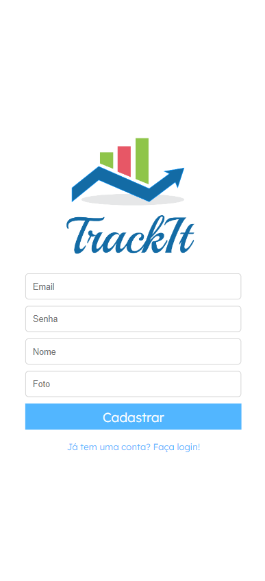
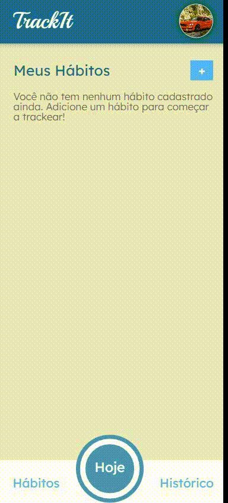
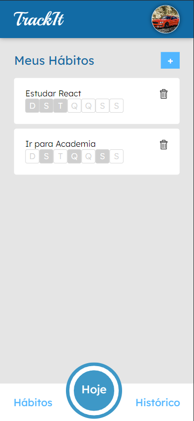
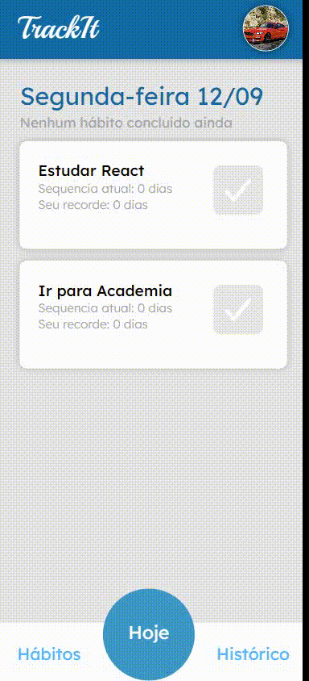

Trackeie seus hábitos saudavéis e complete as suas tarefas com TrackIt.

## Tecnologias 
Algumas tecnologias usadas:

* ReactJS
* React Router dom, Styled Components, Axios...

## Serviços
* Github
* Vercel
  
## Como usar?
### 1 - Quando você acessa, essa é a Tela Inicial.

        
        
        <h4><strong>Obs:</strong> Tela de Login | Tela de Cadastro</h4>

 

### 2 - Logando na plataforma terá um resumo dos seus hábitos.

 

### 3 - Adicionando novos hábitos.

        
        
        <h4><strong>Obs:</strong> Adicionando novos hábitos | Visão Geral dos Hábitos</h4>

 

### 4 - Compra as suas metas e sejá uma pessoa extremamente produtiva. ❤

        
        
        <h4><strong>Obs:</strong> Marcando Hábitos Completados | Hábitos do Dia</h4>

 

## Recursos
  - Layout Mobile 📱
  - Criar uma conta na Plataforma ✨
  - Monitorar Habitos saudavéis do seu dia 👁‍🗨
  - Adicionar Habitos ✅
  - Deletar Habitos ❌ 
  
## Links
  - Deploy Vercel: ***https://track-it-theta.vercel.app/***
  - Repositório: ***https://github.com/Pedro-Hen46/TrackIt***

  ## Autores

  * **Pedro Henrique dos Santos Silva** 
  
   
  
  Me siga no [**Github**](https://github.com/login?return_to=https%3A%2F%2Fgithub.com%2FPedro-Hen46) e Faça uma conexão no [**LinkedIn**](https://www.linkedin.com/in/pedro-henrique-dos-santos-silva-05012289) ❤

  Obrigado por visitar. 
